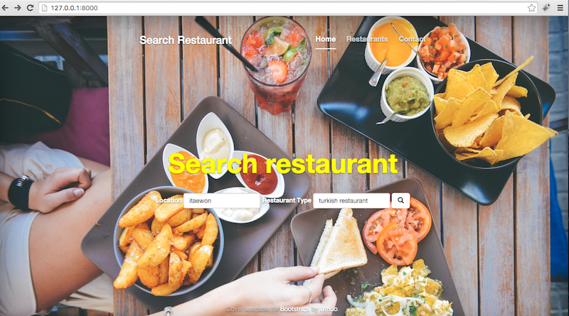

Search Restaurant [Django,iOS,Android]
---

# iOS :

Enter `GOOGLE_API_KEY`, `FOURSQUARE_CLIENT_ID` and `FOURSQUARE_CLIENT_SECRET` in `ViewController.swift`

# Android :

Check android folder.

# Django :

Check Django Folder

