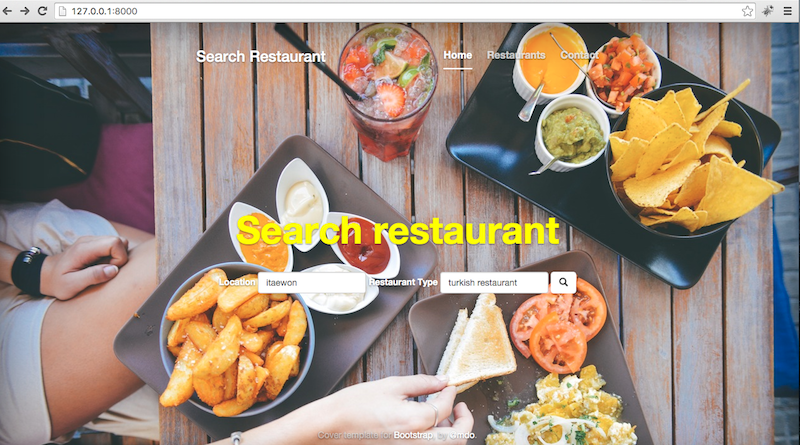

# Search Restaurant

A sample restaurant-search project with a Django REST backend and native
iOS and Android clients. Enter a location and a restaurant type; the
backend geocodes the location, queries a places provider, and returns
matching restaurants which the clients display.



## Repository layout

| Path | What it is | Status |
|------|------------|--------|
| `django/searchrestaurant/` | Django REST API (the maintained core) | Python 3.13 + Django 4.2.x |
| `ios/` | iOS client (UIKit, Swift) | Modernized to Swift 6 / Xcode 26 |
| `android/` | Android client (Java) | Modernized to AGP 8 / AndroidX / SDK 35 |
| `v2/` | Newer experiment | — |

## Backend (Django)

REST API. Runs on **Python 3.13 + Django 4.2.x**.

```bash
cd django/searchrestaurant
python3 -m venv .venv && source .venv/bin/activate
pip install -r requirements.txt
python manage.py migrate
python manage.py runserver
```

- API guide: [API_DOC.md](API_DOC.md). Main endpoint: `GET /api/v1/`
  with `location` and `rtype` query params.
- Interactive docs: Swagger UI at `/docs/`, OpenAPI schema at `/schema/`.
- The Google/Foursquare API keys in `searchrestaurant/settings.py` are
  placeholders — set your own for live results.

## iOS

UIKit app, Swift 6, builds with Xcode 26 for the iOS Simulator with no
third-party dependencies.

```bash
cd ios
xcodebuild -scheme Search_Restaurant -sdk iphonesimulator build
```

Then run in the simulator. Set the backend URL in
`Search Restaurant/ViewController.swift` (`API_BASE_URL`) if you are not
using the hosted instance. See [ios/UPGRADING.md](ios/UPGRADING.md) for
what changed in the Swift 2 → 6 migration.

## Android

Java app, AndroidX, builds with Gradle 8 / AGP 8.

```bash
cd android
./gradlew assembleDebug        # JDK 17 required
```

Or open in Android Studio and run on an emulator. See
[android/UPGRADING.md](android/UPGRADING.md) for migration notes and
follow-ups.

## For contributors / agents

[AGENTS.md](AGENTS.md) documents setup, verification commands, and
project conventions. `CLAUDE.md` points to it.
