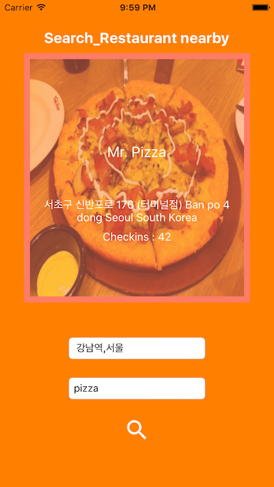

Search Restaurant [Django,iOS,Android]
---

# iOS :

### Introduction:

Apis / SDKs 

1. Google Geocoding API 
2. Google Maps SDK for iOS
3. Google Places Api for iOS
4. Foursquare Api 

Enter `GOOGLE_API_KEY`, `FOURSQUARE_CLIENT_ID` and `FOURSQUARE_CLIENT_SECRET` in `ViewController.swift`

